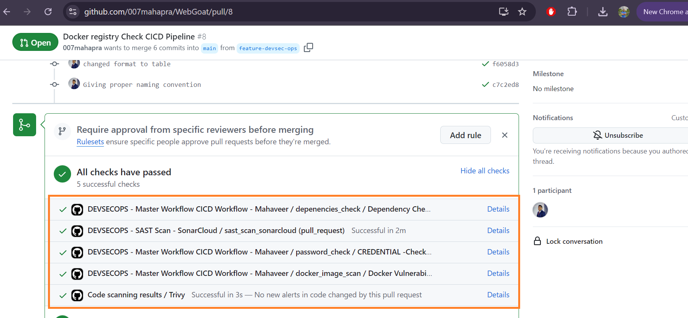
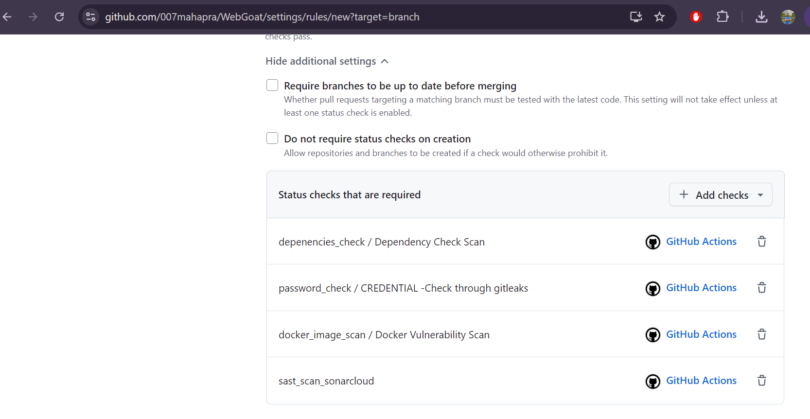
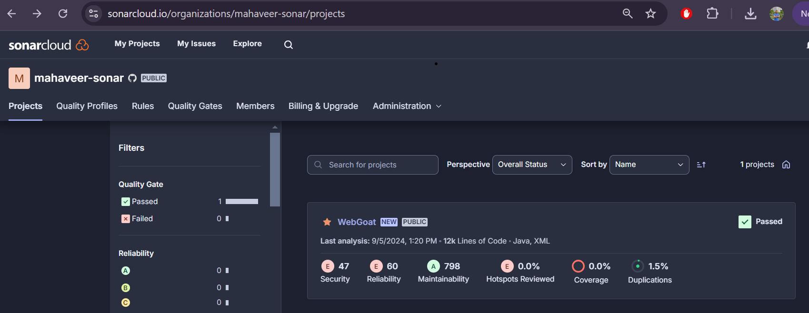
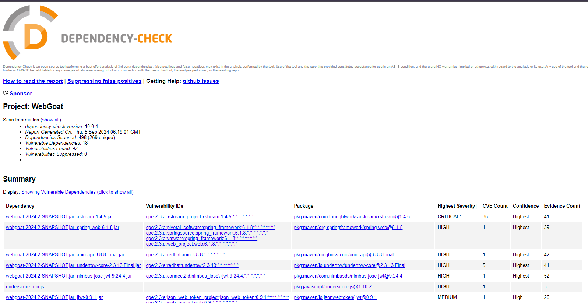
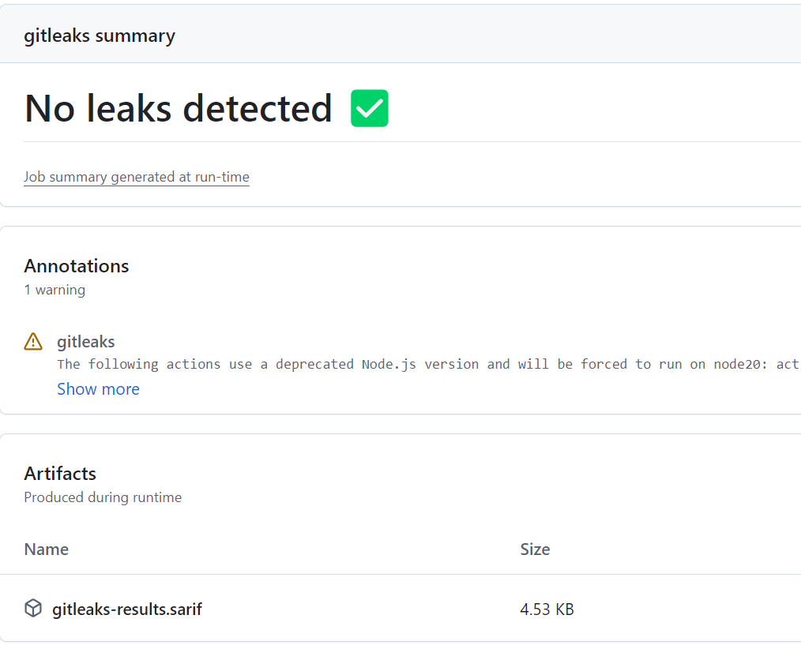
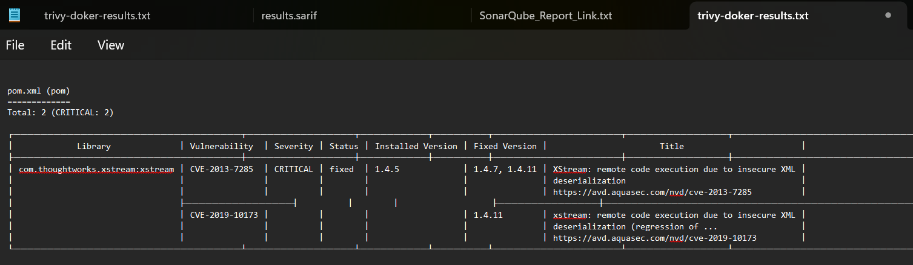

# Introduction

This part of the project shows how the DevSecOps pipeline is implemented in this repo. The DevSecOps pipeline is implemented using GitHub Actions. 
Most of the tools used in the pipeline are open source and free to use. Here is the complete description of how it has been setup.

The DevSecOps pipeline runs on every PR or push to the main branch. If there is any failure or if vulnerabiity criteria is set in any of the steps, the pipeline will fail and the PR will not be merged.

## Forking the WebGoat Repo
Instead of cloning the WebGoat repo, I forked it to my GitHub account. This is because I wanted to use the GitHub Actions workflow to trigger the pipeline. This way If I want I can always keep track of the changes made to the upstream repo.

1. Created main DevSecOps pipeline workflow file in .github/workflows and for all tasks controlling from the main workflow
2. Created individual workflow files for each task and added them to the main workflow file
3. For SAST scan I had some issue hence kept it as a separate workflow but it runs along rest of the pipeline


## DevSecOPs Pipline 
The DevSecOps pipeline covers following 4 component for this repo :
 1. Static Application Security Testing (SAST|CodeQuality) - SonarCloud 
 2. Dependency Check (DC) - DependencyCheck
 3. Secret & Password Scanning - Gitleaks
 4. Docker Vulnerability Scan - Trivy

 All the workflow for DevSecOps pipeline has been created here :
 [DevSecOps Pipeline](.github/workflows/)

The DevSecOps pipeline is triggered when a pull request is created or a push is made to the main branch. The pipeline is triggered by the GitHub Actions. The pipeline runs all 4 steps in parallel and the results are displayed in the GitHub Actions tab.

In the pull request workflow, the pipeline runs all the workflow :
  

The Details of the pipeline can be viewed in the Actions tab of the repository.

 [Summary of pipeline and workflow with all output and artifacts - All 3 Workflows](devsecops-docs/TheCICDPipelineInActions.pdf)

 [Summary of pipeline and workflow with link - SAST Scan Workflow](devsecops-docs/TheCICDPipelineInActions2.pdf)

### Ruleset to protect the main branch from code merge without successful pipeline
  Created a branch protection rule for the main branch to protect it from code merge without successful pipeline. This proptect the merge to happen in main branch until the DevSecOps pipeline is successful.
  


## 1. Static Application Security Testing (SAST|CodeQuality) - SonarCloud 

SonarCloud is a cloud-based platform to analyze code quality. It supports a wide range of languages and can be easily integrated with GitHub or any other SCM.

1. Created a SonarCloud [account](https://sonarcloud.io/organizations/mahaveer-sonar/projects)  
2. Created a project in SonarCloud and added the project key and token to the GitHub repository
3. Referenced the SonarCloud (documentation)[https://docs.sonarsource.com/sonarqube/latest/analyzing-source-code/scanners/sonarscanner-for-maven/] from official site for Maven based project
4. Updated existing POM file with SonarCloud plugin and variables
5. Added SonarCloud workflow ci: 
   -  For scanning PR branches - [sonar-sast-scan](.github/workflows/sonar-sast-scan.yml)
   -  For scanning main branch when the push happens [sonar-sast-scan-main](.github/workflows/main-branch-sast.yml)
6. The report link is made available as artifact after the pipeline is completed
7. The complete report can be viewed in the SonarCloud dashboard which is available in the artifact section of the workflow.
8. I haven't set the quality gate for the pipeline as I couldn't find time and I am not sure if it is required for this project.
9. Here is the output of the SonarCloud report : 
   


## 2. Dependency Check (DC) - DependencyCheck

Dependency Check is a software composition analysis (SCA) tool that identifies project dependencies and checks if there are any known, publicly disclosed, vulnerabilities.

1. Created a DependencyCheck pipline in GitHub Actions referring to [DependencyCheck](https://github.com/marketplace/actions/dependency-check)
2. Created a workflow file [.github/workflows/dependency-check.yml]
3. Added the workflow file to the main workflow file
4. In this task it scans the maven dependencies and checks for any vulnerabilities
5. The report in html is made available as artifact after the pipeline is completed
6. The table show severity, cve number and also shows which dependency is vulnerable, it can be sorted based on severity and cve number and many other options
7. The severity can be rated from 0 to 10 and 0 is the highest severity and 10 is the highest severity. The CICD pipeline will fail if any vulnerability of defined severity is found. (I have commented out the severity check in the pipeline).
```
          # args: >
          #   --failOnCVSS 7
          #   --enableRetired
```
7. Here is the output of the dependency check report : 
   


## 3. Secret & Password Scanning - Gitleaks
Gitleaks is a tool to detect and prevent hardcoded secrets like passwords, api keys, and tokens in code. It is open source and free to use. It generates a report in html format.

1. Created a Gitleaks pipline in GitHub Actions referring to [Gitleaks](https://github.com/gitleaks/gitleaks-action/tree/v2/)
2. After successful scan it generates output in summary and [sarif file](https://docs.github.com/en/code-security/code-scanning/integrating-with-code-scanning/sarif-support-for-code-scanning) which can be shown in the GitHub Security tab.

  


## 4. Docker Vulnerability Scan - Trivy

Trivy is a simple and comprehensive vulnerability scanner for containers and other artifacts.

1. Created a Trivy pipline in GitHub Actions referring to [Trivy](https://github.com/aquasecurity/trivy-action)
2. It checks for vulnerabilities in the docker image and generates a report in table format in artifact section of the workflow.
3. The report shows the severity, cve number and also shows which library is vulnerable
5. I have set it to check only for critical vulnerabilities, but it can be configured to check for other severities as well.
      ```bash
          ignore-unfixed: true
          vuln-type: 'os,library'
          severity: 'CRITICAL,HIGH'
      ```
6. The output of the trivy scan is shown below : 
   


## References
Here are the references used for the setup of the DevSecOps pipeline :


https://docs.sonarsource.com/sonarqube/latest/devops-platform-integration/github-integration/adding-analysis-to-github-actions-workflow/

https://docs.sonarsource.com/sonarqube/latest/analyzing-source-code/scanners/sonarscanner-for-maven/

https://github.com/dependency-check/dependency-check-sonar-plugin

https://community.sonarsource.com/t/how-to-configure-sonarqube-dependency-check-page-with-laravel-in-php/81334/2

https://github.com/dependency-check/dependency-check-sonar-plugin/tree/master/examples/single-module-maven

https://medium.com/@giannakopoulosj/sonarqube-owasp-dependency-check-for-java-7431b9620d6c


https://jeremylong.github.io/DependencyCheck/dependency-check-maven/

https://github.com/marketplace/actions/dependency-check


Self approver feature is not available yet in GitHub. so running the workflow on reviewd.
https://github.com/orgs/community/discussions/6292

https://github.com/gitleaks/gitleaks
